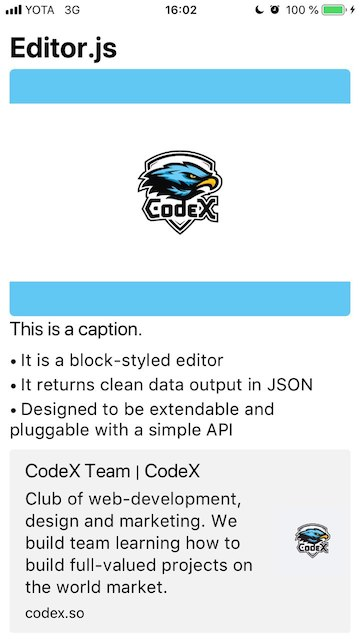

<p align="center">
  
</p>

[](https://cocoapods.org/pods/EditorJSKit)
[](https://cocoapods.org/pods/EditorJSKit)
[](https://cocoapods.org/pods/EditorJSKit)

## About

Is an iOS Framework for [Editor.js](https://editorjs.io) generated clean data. It's purpose to make easy use of rendering and parsing of blocks.

<p align="left">
  
</p>

#### Supported blocks
* 🎩 Header
* 🥑 Raw HTML
* 📷 Image
* 🖌 Delimiter
* 💌 Paragraph
* 🕸 Link
* 🌿 List


## Usage
1. Create a collectionView:
``` swift
let collectionView = UICollectionView(frame: .zero, collectionViewLayout: UICollectionViewFlowLayout())
```

2. Set `collectionView.delegate` and `collectionView.dataSource` to `self`

3. Create a renderer:
``` swift
let renderer = EJCollectionRenderer(collectionView: collectionView)
```

4. Decode your data with `EJBLockList` type. 

5. Store decoded list in blockList variable `var blockList: EJBlockList!`

6. Implement data source and delegate methods .
``` swift
///
extension ViewController: UICollectionViewDataSource {
    
    func numberOfSections(in collectionView: UICollectionView) -> Int {
        return blockList.blocks.count
    }
    
    func collectionView(_ collectionView: UICollectionView, numberOfItemsInSection section: Int) -> Int {
        return blockList.blocks[section].data.numberOfItems
    }
    
    
    func collectionView(_ collectionView: UICollectionView, cellForItemAt indexPath: IndexPath) -> UICollectionViewCell {
        do {
            return try renderer.render(block: blockList.blocks[indexPath.section], itemIndexPath: indexPath)
        }
        catch {
            return UICollectionViewCell()
        }
    }
}

///
extension ViewController: UICollectionViewDelegateFlowLayout {
    func collectionView(_ collectionView: UICollectionView, layout collectionViewLayout: UICollectionViewLayout, sizeForItemAt indexPath: IndexPath) -> CGSize {
        do {
            return try renderer.size(forBlock: blockList.blocks[indexPath.section], itemIndexPath: indexPath, style: nil, superviewSize: collectionView.frame.size)
        } catch {
            return CGSize(width: 100, height: 100)
        }
    }
}
```


## Example

To run the example project, clone the repo, and run `pod install` from the Example directory first.

## Installation

EditorJSKit is available through [CocoaPods](https://cocoapods.org). To install
it, simply add the following line to your Podfile:

```ruby
pod 'EditorJSKit'
```

## Author

[Upstarts](https://upstarts.work)                 
[Ivan Glushko](https://github.com/ivanglushko)

